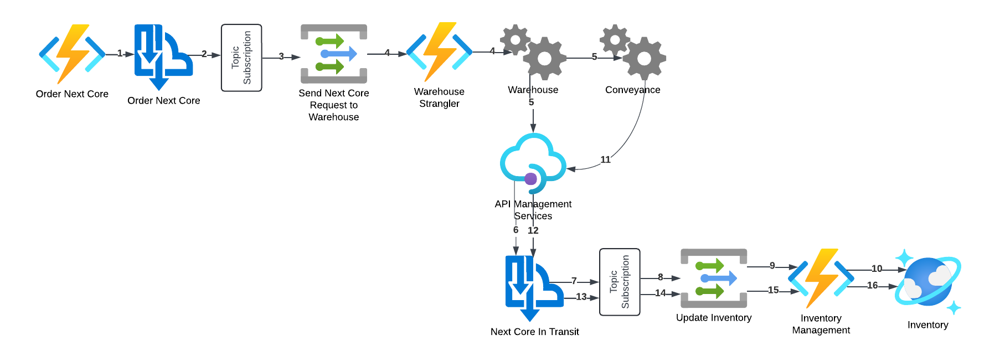

[Design and Develop a Serverless Event-Driven Microservice-Based Solution](https://github.com/TaleLearnCode/EDAMicroserviceWorkshop) \ [Nebraska.Code 2024](README.md)  \ [Labs](README.md) \

# Lab 6: Order Next Core

We have everything ready to start building the microservices and will start by creating the **Order Next Core** microservice.

## Prerequisites

- Completion of  [Lab 5](05-create-terraform-pipeline.md) 
- Terraform installed on your local machine
- Azure CLI installed and authenticated on your local machine

## Microservice Process

Before we start building resources and writing code, let's understand what all the **Order Next Core** microservice will be doing. But before that, a quick caveat: we will be building more than just the actual microservice as it needs to connect to services outside of its boundaries and we do not have those resources. So we will be creating those "external" services as part of the lab.

At the highest levels, here are the details of the **Order Next Core** microservice:

- **Entry:** The remanufacturing pod needs the next scheduled core so that it can be remanufactured into a product for sale.
- **Exit**: The core has been received.
- **Business Workflow**:
  - The pod submits a request to the warehouse for the next core for the pod to remanufacture.
  - The warehouse picks the core and turns it over to conveyance.
  - Conveyance transports the core to the pod.
  - At each step, the status of the core will be updated.

Here are the steps that the microservice and the external services depend on performing, along with the Azure resources involved, in more detail.




0. A request for the next core to be remanufactured is sent to the **Order Next Core** Azure Function.
1. The **Order Next Core** Azure Function sends a message to the **Order Next Core** Azure Service Bus topic.
2. The **Send Next Core Request to Warehouse** subscription filters the incoming messages for the ones needed by the warehouse.
3. The **Send Next Core Request to Warehouse** subscription sends the appropriate message(s) to the **Send Next Core Request to Warehouse** Event Grid topic.
4. The **Warehouse Strangler** Azure Function is triggered by the **Send Next Core Request to Warehouse** Event Grid topic
5. The **Warehouse Strangler** Azure Function sends the appropriate information to the **Warehouse**.
6. Once the Warehouse personnel have picked the core, they notify conveyance that it is in the pickup spot for them. The Warehouse will also inform The *Order Next Core* microservice via a REST call on the API Management services that they have dropped off the core to conveyance.
7. The **API Management Services** instance will transform the incoming REST call to a message on the **Next Core in Transit** Service Bus Topic.
8. The **Update Inventory** subscription filters the incoming messages for the ones needed for the *Update Inventory* process.
9. The **Update Inventory** Event Grid topic receives the appropriate messages from the **Update Inventory** subscription.
10. The **Update Inventory** Event Grid topic triggers the **Inventory Manager** Azure Function.
11. The **Inventory Manager** Azure Function updates the inventory status in the **Inventory** Cosmos DB database.
12. Once the Conveyance member starts their route to the pod with the next core, the Conveyance system will inform the pod that the core is on its way.
13. The **API Management Services** instance will transform the incoming REST call to a message on the **Next Core in Transit** Service Bus Topic.
14. The **Update Inventory** subscription filters the incoming messages for the ones needed for the *Update Inventory* process.
15. The **Update Inventory** Event Grid topic receives the appropriate messages from the **Update Inventory** subscription.
16. The **Update Inventory** Event Grid topic triggers the **Inventory Manager** Azure Function.
17. The **Inventory Manager** Azure Function updates the inventory status in the **Inventory** Cosmos DB database.

> Notice the **Warehouse Strangler** Azure Function. In our scenario, the Warehouse is using legacy software, and that software will not be updated at the same time as the **Order Next Core** microservice is developed. So we will use a variation of the strangler pattern to add something to act in the place of updated Warehouse functionality until that functionality can be written.

> For the purpose of the workshop, we are going to build Azure Functions to represent the Warehouse and Conveyance functionality. In a real-world scenario, these would be separate systems for which the **Order Next Core** development team wouldn't necessarily have visibility other than incoming/outgoing calls.

## Steps

### Step 0: Create the order-next-core.tf configuration file

1. (If not already) open Visual Studio Code.
2. (If not already) open the repository folder.
3. In the `infra` folder, create the `order-next-core.tf` file and add the following configuration:

```hcl
# #############################################################################
# Order Next Core
# #############################################################################
```

> As a reminder, in a real-world scenario, you will want to separate your Terraform configuration projects by microservice, as they should be completely independent. For this workshop, we are using one project to simplify the instructions.

## Step 1: Send Next Core Request to Warehouse Messaging

First, let's set up the messaging components to send the next core request to the warehouse.

1. Add the following configuration to the **Modules** section of the `main.tf` file:

```hcl
module "event_grid_topic" {
  source = "git::https://github.com/TaleLearnCode/azure-resource-types.git"
  resource_type = "event-grid-topic"
}

module "service_bus_topic" {
  source = "git::https://github.com/TaleLearnCode/azure-resource-types.git"
  resource_type = "service-bus-topic"
}

module "service_bus_topic_subscription" {
  source = "git::https://github.com/TaleLearnCode/azure-resource-types.git"
  resource_type = "service-bus-topic-subscription"
}
```

2. Install the added modules into the local Terraform state; from the Visual Studio Code Terminal window and within the `infra` folder:

```
terraform init --backend-config=dev.tfconfig
```

3. Validate the added configuration

```
terraform validate
```

4. Add the following configuration to the `order-next-core.tf` file:

```hcl
# ------------------------------------------------------------------------------
# Step 1: Send Next Core Request to Warehouse Mesaging
# ------------------------------------------------------------------------------

# ebt-SendNextCoreRequestToWarehouseXXX-dev-cus
resource "azurerm_eventgrid_topic" "send_next_core_request_to_warehouse" {
  name                = "${module.event_grid_topic.name.abbreviation}-SendNextCoreRequestToWarehouse${var.resource_name_suffix}-${var.azure_environment}-${module.azure_regions.region.region_short}"
  location            = data.azurerm_resource_group.rg.location
  resource_group_name = data.azurerm_resource_group.rg.name
  identity {
    type = "SystemAssigned"
  }
  tags = local.tags
}

# sbt-OrderNextCore-dev-cus
resource "azurerm_servicebus_topic" "order_next_core" {
  name                      = "${module.service_bus_topic.name.abbreviation}-OrderNextCore-${var.azure_environment}-${module.azure_regions.region.region_short}"
  namespace_id              = azurerm_servicebus_namespace.remanufacturing.id
  support_ordering          = true
  enable_batched_operations = true
  depends_on = [ 
    azurerm_servicebus_namespace.remanufacturing
   ]
}

# SendNextCoreRequestToWarehouse (ebt-SendNextCoreRequestToWarehouseXXX-dev-cus) -> OrderNextCore (sbt-OrderNextCore-dev-cus
resource "azurerm_eventgrid_event_subscription" "send_next_core_request_to_warehouse" {
  name                          = "SendNextCoreRequestToWarehouse"
  scope                         = azurerm_eventgrid_topic.send_next_core_request_to_warehouse.id
  service_bus_queue_endpoint_id = azurerm_servicebus_topic.order_next_core.id
  depends_on = [
    azurerm_servicebus_topic.order_next_core,
    azurerm_eventgrid_topic.send_next_core_request_to_warehouse
  ]
}
```

5. 

### Step 2: Send Order Next Core Message

Now that the messaging components are in place, let's add the Azure Function app to initiate everything.

#### Step 2a: Add Terraform configuration

1. Add the following configuration to the **Modules** section of the `main.tf` file:

```hcl
module "storage_account" {
  source        = "git::https://github.com/TaleLearnCode/azure-resource-types.git"
  resource_type = "storage-account"
}

module "app_service_plan" {
  source = "git::https://github.com/TaleLearnCode/azure-resource-types.git"
  resource_type = "app-service-plan"
}

module "function_app" {
  source = "git::https://github.com/TaleLearnCode/azure-resource-types.git"
  resource_type = "function-app"
}
```

2. Install the added modules into the local Terraform state; from the Visual Studio Code Terminal window and within the `infra` folder:

```
terraform init --backend-config=dev.tfconfig
```

3. Validate the added configuration

```
terraform validate
```

4. Add the following configuration to the `order-next-core.tf` file:

```hcl
# ------------------------------------------------------------------------------
# Step 2: Send Next Core Response to Warehouse Mesaging
# ------------------------------------------------------------------------------

# Storage account for the OrderNextCore Azure Function app
resource "azurerm_storage_account" "order_next_core" {
  name                     = "${module.storage_account.name.abbreviation}onc${var.resource_name_suffix}${var.azure_environment}${module.azure_regions.region.region_short}"
  resource_group_name      = data.azurerm_resource_group.rg.name
  location                 = data.azurerm_resource_group.rg.location
  account_tier             = "Standard"
  account_replication_type = "LRS"
  tags = local.tags
}

# App Service Plan for the OrderNextCore Azure Function app
resource "azurerm_service_plan" "order_next_core" {
  name                = "${module.app_service_plan.name.abbreviation}-OrderNextCore${var.resource_name_suffix}-${var.azure_environment}-${module.azure_regions.region.region_short}"
  resource_group_name = data.azurerm_resource_group.rg.name
  location            = data.azurerm_resource_group.rg.location
  os_type             = "Linux"
  sku_name            = "Y1"
  tags                = local.tags
}

# OrderNextCore Azure Function app
resource "azurerm_linux_function_app" "order_next_core" {
  name                       = "${module.function_app.name.abbreviation}-OrderNextCore${var.resource_name_suffix}-${var.azure_environment}-${module.azure_regions.region.region_short}"
  resource_group_name        = data.azurerm_resource_group.rg.name
  location                   = data.azurerm_resource_group.rg.location
  storage_account_name       = azurerm_storage_account.order_next_core.name
  storage_account_access_key = azurerm_storage_account.order_next_core.primary_access_key
  service_plan_id            = azurerm_service_plan.order_next_core.id
  tags                       = local.tags
  identity {
    type = "SystemAssigned"
  }
  site_config {
    application_stack {
      dotnet_version              = "8.0"
      use_dotnet_isolated_runtime = true
    }
    cors {
      allowed_origins = ["https://portal.azure.com"]
    }
    application_insights_connection_string = azurerm_application_insights.app_insights.instrumentation_key
    application_insights_key               = azurerm_application_insights.app_insights.instrumentation_key
  }
}
```

The following resources are being created as part of this configuration:

- **func-OrderNextCoreXXX-dev-cus**: This is the Azure Function that is the primary component of the **Order Next Core** microservice.
- **app-OrderNextCoreXXX-dev-cus**: The Azure Service Plan that will host the Azure Function app above.
- **stoncXXXdevcus**: The storage account used by the Azure Function app above.

5. Validate that the added configuration syntax is correct; from the Visual Studio Code Terminal window and in the `infra` folder:

```
terraform Validate
```

6. Build a Terraform plan to ensure the configuration is still plannable; from the Visual Studio Code Terminal window and in the `infra` folder:

```sh
terraform plan
```

You should receive a message like: **Plan:** 3 to add, 0 to change, 0 to destroy.

7. Commit and push changes to the centralized Git repository:

   - Click on the `Source Control` tab within Visual Studio code.
   - Add an appropriate commit message:

   ```
   Adding OrderNextCore Azure Function infrastructure.
   ```

   - Click the **Commit** button (this will perform a `git commit` command).
   - Click the **Sync Changes** button (this will perform a `git push` command).

> At this time, the Terraform pipeline should have kicked off to add the new Azure Function app components.

#### Step 2b. Initialize the Remanufacturing solution

1. Open Visual Studio (not Visual Studio Code)

> You could continue to use Visual Studio Code for the following steps, but the instructions are written for Visual Studio.

2. Click the "**Create a new project**" button from the Visual Studio **Start Window**.
3. Search for **Blank Solution** and click the **Next** button.
4. Enter `Remanufacturing` in the "**Solution name**" field and search for the `src` folder within your *Cool Revive Remanufacturing* repository folder. Click the **Create** button.

#### Step 2c: Create the Remanufacturing Messages class library

1. Right-click the `Remanufacturing` project and select **Add** > "**New project**".
2. Search for and select **Class Library** and then click the **Next** button.
3. Enter `Remanufacturing.Messaging` as the "**Project name**" and click the **Next** button.
4. Select `.NET 8.0 (Long Term Support)` for the **Framework** and click the **Create** button.
5. Delete the `Class1`.cs` file.
6. Double-click the `Remanufacturing.Messaging` project to open the csproj file.
7. Add `<RootNamespace>Remanufacutring</RootNamespace>` to the `PropertyGroup`. Your csproj file should resemble:

```xml	
<Project Sdk="Microsoft.NET.Sdk">

  <PropertyGroup>
    <TargetFramework>net8.0</TargetFramework>
    <ImplicitUsings>enable</ImplicitUsings>
    <Nullable>enable</Nullable>
    <RootNamespace>Remanufacturing</RootNamespace>
  </PropertyGroup>

</Project>
```

8. Add a folder named `Messages` to the project.
9. Add a class named `NextCoreRequestMessage.cs` to the project and replace the contents of the file with:

``` c#
namespace Remanufacturing.Messages;

public class NextCoreRequestMessage
{
	public string PodId { get; set; } = null!;
	public string CoreId { get; set; } = null!;
	public DateTime RequestDateTime { get; set; }
}
```

> [!TIP]
>
> Messages should convey precisely what is needed and not contain information that is not very potentially used by the direct consumers of the message. This message is overly simplified for the purposes of the workshop.

#### Step 2d: Create the Order Next Core Azure Function App

1. Right-click the `Remanufacturing` project and select **Add** > "**New project**".
2. Search for and select **Azure Functions** and then click the **Next** button.
3. Enter `OrderNextCore.Functions` as the "**Project name**" and click the **Next** button.Select the following options on the "**Additional information**" window and then click the **Create** button:
   - **Function worker**: .NET 8.0 Isolated (Long Term Support)
   - **Function**: Http trigger
   - **Use Azurite for runtime storage account (AzureWebJobsStorage)**: checked
   - **Enable container support**: unchecked
   - **Authorization level**: Function
   - **Enable in .NET Aspire orchestration**: unchecked
4. Delete the auto-generated `Function1.cs` file.
5. Double-click the project in order to open the csproj file and add '<RootNamespace>Remanufacturing.OrderNextCore</RootNamespace>' to the '<PropertyGroup>' element.
6. Right-click the project and select **Add** > "**Project Reference...**".
7. Select the `Remanufacturing.Messaging` project and click the **OK** button.
8. Add a folder named `Functions` to the project.
9. Right-click the `Functions` folder and select the **Add** > "**New Azure Function**" option.
10. Name the new Azure Function `OrderNextCore.cs` and click the **Add** button.
11. Select "**Http trigger**" and click the **Add** button.
12. Replace the auto-generated code with the following:

```c#
```

